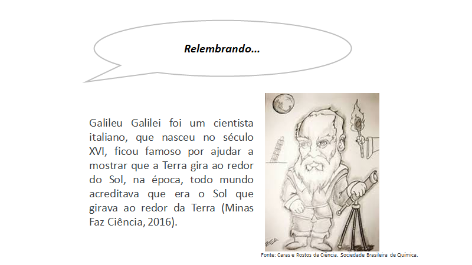

# A Investigação Científica {#cap2}

## Tudo começa com uma pergunta

No Capítulo \@ref(cap1) você viu que qualquer um pode ser um cientista, e que a **ciência** pode ser realizada em diversos ambientes não apenas em laboratórios, bem como está presente em diversas profissões e disciplinas escolares. Além disso, a ciência não é algo pronto, acabado ela está em **constante construção**, em **evolução**. E que a **investigação científica** é a forma que os cientistas ou pesquisadores criaram para que o **conhecimento progrida**, ou seja, é o caminho que se percorre para produção da ciência. Por meio da investigação científica é possível alcançar o conhecimento seja pelo **entendimento** dos fenômenos da natureza, do comportamento das pessoas ou para resolver algum problema da sociedade. Em geral, uma investigação científica começa com uma **pergunta** ou **questionamento**: Será? Como? Com que? Onde? Por que e O que acontece se? sobre alguma observação ou situação. 

```{r figura21, echo=FALSE, out.width = '80%', fig.align='center'}

```

Elaborar uma pergunta é a etapa mais importante de toda e qualquer investigação científica. Mas, quando uma pergunta é científica? Será que qualquer pergunta pode originar uma investigação científica? Qual diferença de uma pergunta científica de uma não científica? Será que minha pergunta, de fato, exige a realização de uma pesquisa científica para que possa ser respondida? Ou pode ser facilmente resolvida com uma simples consulta às fontes de informação disponíveis, como: revistas especializadas, enciclopédias, consulta à internet, entre outras? Na Figura abaixo trazemos exemplos de algumas perguntas, você consegue distinguir quais dessas perguntas são científicas?

```{r figura22, echo=FALSE, out.width = '70%', fig.align='center'}

```

Se você respondeu que as perguntas 3, 4 e 5 são científicas está correto. Mas, por que as perguntas 1 e 2 não são científicas? Se fizermos uma busca no Google em menos de um minuto achamos que o carro mais rápido do mundo é o Bugatti Chiron, este automóvel alcança uma velocidade de 420 Km/h, e que o tamanho do sol é 1 392 700 Km. Então, para responder à essas perguntas não foi preciso de estudos elaborados ou desenvolvimento de projetos de pesquisa, ou seja, rapidamente encontramos as respostas em uma simples consulta na internet. 

```{r figura23, echo=FALSE, out.width = '70%', fig.align='center'}
knitr::include_graphics("fig_cap2/fig3_cap2.png")
```

Enquanto que para responder as perguntas 3, 4 e 5 é necessário realizar um estudo mais detalhado. Precisamos ter em mente o seguinte: “Será que a minha pergunta comporta uma investigação ou se esgota numa simples consulta a uma fonte de informação?”. Por exemplo, a pergunta “Como educar com jogos?” ser um assunto muito pesquisado ao redor do mundo, ainda assim é científica. Pois, os estudos existentes abordam formas distintas de como educar com jogos, cada pessoa aprende de uma forma diferente. Isso quer dizer que a pesquisa estará relacionada ao tipo de jogo, e ao grupo de pessoas que participará da investigação.

Outro aspecto relevante é que toda investigação científica possui uma motivação ou justificativa para sua realização. Qual a importância de se conhecer mais sobre um determinado assunto ou ainda, essa pesquisa vai trazer algum benefício às pessoas da minha cidade, do meu bairro, da minha escola? Por exemplo, pesquisadores do mundo todo, comunidade científica, estão desenvolvendo estudos para encontrar vacinas contra o SARS Cov 2, vírus que transmite à Covid 19. Você já parou para pensar como o descobrimento da vacina retornará como um benefício coletivo planetário? A busca por uma vacina que seja capaz de combater o vírus da COVID-19 é, sem dúvidas, o maior desafio que a comunidade científica da área de saúde encontra na atualidade. Quer melhor motivação ou justificativa para essa Investigação Científica?

```{r figura24, echo=FALSE, out.width = '80%', fig.align='center'}

```

<div align = "center">
<iframe width="560" height="315" src="https://www.youtube.com/embed/R2AhN9PRx1I" frameborder="0" allow="accelerometer; autoplay; clipboard-write; encrypted-media; gyroscope; picture-in-picture" allowfullscreen></iframe>
</div>
</br>

## Próximos passos após formulação da pergunta

Falamos sobre as perguntas, mas e as respostas? Uma vez formulada a pergunta, a etapa seguinte é reunir todas as informações possíveis sobre a investigação por meio de:

      i.    pesquisa prévia;
      ii.   observações e experimentos; 
      iii.   resultados das observações ou conclusões
      
<center>★	Por que realizar a pesquisa prévia?</center>

  - Porque necessitamos verificar tudo que já se sabe sobre o assunto que queremos investigar. Essa etapa nos ajudará a imaginar o que acontecerá nos experimentos ou imaginar possíveis respostas é o que conhecemos como Hipótese. Ou seja, quais seriam as supostas soluções ou respostas para minha pergunta científica? Geralmente, a hipótese apoia-se em saberes prévios do pesquisador e, também, em um levantamento de informações e conhecimentos em fontes de consulta disponíveis, a pesquisa prévia.
  Uma hipótese é uma resposta potencial a uma questão. A hipótese não é, necessariamente, a explicação correta. No entanto, é uma explicação possível, que podemos testar para ver se está correta ou se é necessário criar novas hipóteses. É a partir dela que a etapa de experimentação será realizada. A hipótese serve como guia da nossa investigação, ela direciona quais serão nossos próximos passos. 

<center>★	Mas, qualquer explicação pode ser considerada uma hipótese?</center>

  - Não. Todas as hipóteses precisam ser testadas para serem validadas ou não. Então, como confirmar ou negar minha hipótese?  Agora que já temos nossa pergunta, hipótese e justificativa, o que temos de fazer para continuar nossa investigação? Acredito que alguns de vocês responderam pesquisando, testando, por meio de experimentos. De certo modo todas essas respostas estão corretas pois, não existe uma única forma de testar se uma hipótese é verdadeira ou falsa. Mas, em geral a maneira mais utilizada é por meio de observações e experimentos. 

<center>★	Por que as observações e os experimentos são necessários? </center>

  - As observações e os experimentos são necessários para que possamos comparar os resultados com as Hipóteses que formulamos. Os experimentos ou testes realizados irão fornecer dados que mostrarão se as hipóteses formuladas serão confirmadas ou rejeitadas. Para realização de um experimento alguns procedimentos investigativos precisam ser estabelecidos, conforme ilustra a figura a seguir:


```{r figura25, echo=FALSE, out.width = '60%', fig.align='center'}

```


A coleta dos dados pode ser realizada por meio de banco de dados disponibilizados na internet, leituras de textos sobre os assuntos pesquisados, da aplicação de questionários, ou em laboratórios. Os experimentos podem ser conduzidos sem ajuda de instrumentos ou equipamentos – usando apenas visão, audição, tato, paladar ou com ajuda de instrumentos – régua, termômetro, balança, cronômetro, cadernos, livros, GPS, computadores, celulares etc.  

Além de estabelecer os meios e os equipamentos a serem utilizados durante a realização de uma investigação científica é preciso realizar o planejamento da pesquisa, com  a definição da quantidade de pessoas que irão participar do projeto, estimar o tempo que será gasto para realização de cada atividade, ou seja, é necessário elaborar o cronograma de execução das atividades previstas. 

Passada a etapa de coleta de dados e informações, após as observações e os experimentos, torna-se necessário analisar as descobertas obtidas. Pois, o produto que resultará dessas análises é que nos permitirá elaborar uma resposta possível à questão de investigação. A resposta encontrada poderá confirmar a hipótese de trabalho, ou negá-la. As análises são realizadas em função dos conhecimentos sobre o assunto em estudo, e que foram levantados na fase inicial do processo investigativo. Após a análise, podemos elaborar as Conclusões da nossa investigação e responder a pergunta inicialmente elaborada.

Todos os passos listados fazem parte do processo investigativo ou método científico, que são etapas que se pretende percorrer para encontrar a resposta da pergunta científica, confirmando ou não a hipótese ou hipóteses estabelecidas. Você sabe quem inventou – estruturou o método científico? Foi Galileu Galilei, já falamos sobre ele no Capítulo \@ref(cap1). 

```{r figura26, echo=FALSE, out.width = '70%', fig.align='center'}

```

## Testando a hipótese 

Se a Hipótese for confirmada por meio da análise dos resultados obtidos, pode-se elaborar uma Teoria. Em outras palavras a teoria explica por que algo acontece daquela forma, com base nas observações e experimentos. O vídeo **É só uma teoria/Nerdologia** é bem bacana e explica “O que as estrelas tem a ver com a evolução humana?” 

<div align = "center">
<iframe width="560" height="315" src="https://www.youtube.com/embed/kyGu9lTr_jM" frameborder="0" allow="accelerometer; autoplay; clipboard-write; encrypted-media; gyroscope; picture-in-picture" allowfullscreen></iframe>
</div>
</br>

```{r figura27, echo=FALSE, out.width = '70%', fig.align='center'}
knitr::include_graphics("fig_cap2/fig7_cap2.png")
```


Mas, se a Hipótese não for confirmada, uma nova Hipótese Precisa ser formulada e testada! Basicamente, a ciência é feita de tentativas e erros. Na Ciência errar não significa fracassar, outros caminhos diferentes podem existir, levando a novas descobertas. É dessa maneira que a ciência avança! A seguir são apresentados exemplos de erros bons.

```{r figura28, echo=FALSE, out.width = '80%', fig.align='center'}
knitr::include_graphics("fig_cap2/fig8_cap2.png")
```

```{r figura29, echo=FALSE, out.width = '80%', fig.align='center'}

```


O Quadro Colaborativo apresentado a seguir sintetiza de maneira ilustrativa os elementos que compõem uma investigação científica, bem como os conceitos a eles associados. Destaca-se que esse Quadro foi construído por um grupo de estudantes integrantes do Projeto Ciência da Dados na Educação Pública. 

```{r figura210, echo=FALSE, out.width = '100%', fig.align='center'}

```
