# Observação e Experimentos Científicos {#cap3}

## A observação e os tipos de experimentos científicos

No Capítulo \@ref(cap2) vimos que as observações e os experimentos irão fornecer dados ou informações que mostrarão se as hipóteses formuladas serão confirmadas ou rejeitadas. Entretanto, nem sempre a investigação científica pode ser guiada por experimentos planejados, pois em alguns casos de produção científica os cientistas lidam com eventos que ocorreram a milhares de anos, que ainda vão ocorrer, ou ocorreram/ocorrerão em locais que os seres humanos ainda não conseguiram chegar. Nesse caso, os pesquisadores fazem pouco ou nenhum uso de experimentos. Por exemplo, existem campos da ciência - como a Geologia e a Cosmologia, no qual os experimentos não podem ser planejados. 

```{r figura31, echo=FALSE, out.width = '70%', fig.align='center'}
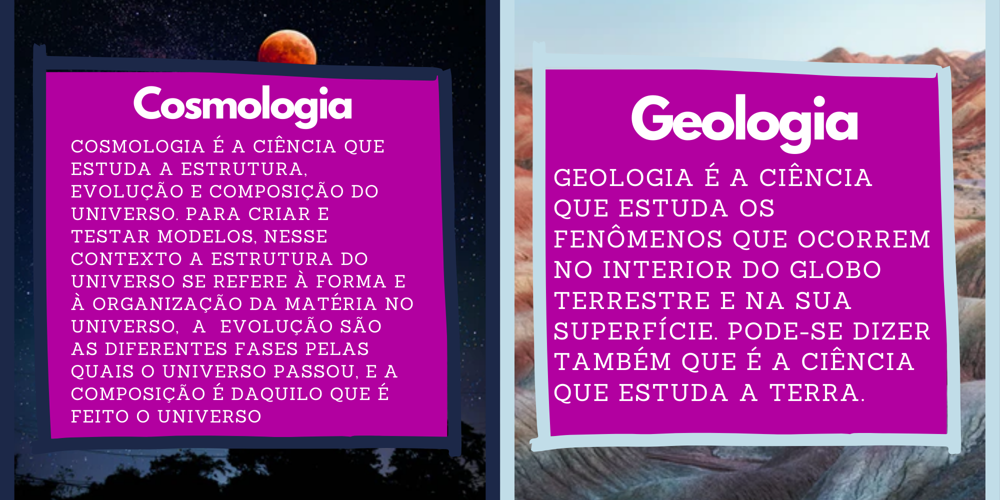
```

Outro exemplo interessante, são as hipóteses em meteorologia: Quando queremos criar hipóteses sobre se durante o dia irá chover, fazer sol ou ventar muito, podemos olhar para o céu buscando por características já conhecidas de chuva ou ventos fortes e criar hipóteses confiáveis. Elas podem ser confirmadas ou negadas por meio de observações não planejadas do próprio tempo meteorológico.

Em alguns ramos da medicina, experimentos podem não ser possíveis, ou podem ser indesejáveis por motivos éticos. É considerado antiético e ilegal a compra de órgãos em países como o Brasil, sendo necessário que eles sejam recebidos por meio de doações. Dessa forma, um pesquisador pode não conseguir acesso a algum órgão humano necessário para a realização de uma pesquisa, por exemplo. 

Os experimentos podem ser definidos como ação ou efeito de experimentar, ou como análise/trabalho científico que tem por objetivo comprovar um fenômeno, ou testar uma hipótese. Já a observação pode ser definida como o ato ou efeito de observar, ato este de extremo valor quando o assunto é investigação científica. Pode-se fazer uma observação isolada para fins científicos ou não-científicos, como pode-se incluir uma observação como uma das etapas de uma investigação científica. no contexto de uma pesquisa em particular. 

### Mas quando usamos a observação e quando usamos os experimentos? 

O meio que iremos utilizar para confirmar ou negar a nossa hipótese depende de vários fatores diferentes. Quando não temos controle sobre os fatores que interferem no que desejamos descobrir, ou seja, não podemos controlar o objeto ou acontecimento que estamos estudando, normalmente só é possível utilizar a observação para realizar as descobertas. Já quando temos controle desses fatores, é mais recomendado que sejam feitos experimentos.

Por exemplo, quando queremos entender um fenômeno da Cosmologia. Geralmente, quando se estuda astronomia utiliza-se de instrumentos sofisticados, como telescópios super modernos para investigação/pesquisa dos astros, essa prática é considerada uma observação, já que não existe uma forma de controlar o objeto de estudo (os planetas, as estrelas e outros corpos celestes). Nela, apesar de se usar instrumentos sofisticados para fazer análises, telescópios muito modernos para observações, tanto na Terra como em satélites, tudo isso ainda é considerado observação, já que não há uma forma de controlar o nosso objeto de estudo (os astros). 

Mas, por exemplo, quando queremos descobrir o valor do potencial hidrogeniônico (Ph) de uma solução ou substância, é muito difícil chegar a uma resposta confiável somente com a observação e nós podemos controlar a solução ou substância que estamos estudando. Isso ocorre pois podem existir substâncias com aparências e cheiros muito parecidos com valores de Ph completamente diferentes. Nesse caso, existe um procedimento experimental que pode auxiliar na descoberta. Para ajudar no procedimento investigativo, podem ser usadas soluções que mudam de cor dependendo do valor do Ph ou papéis indicadores. 

Quando o procedimento experimental envolve o papel indicador o experimento segue as seguintes etapas: o papel é inserido na solução; ao entrar em contato com a solução ele irá assumir uma coloração específica; essa coloração deve ser comparada a uma legenda; e assim, dependendo da cor que ele apresentar, a legenda indicará o valor do Ph da solução.

**Percebe a diferença?** No caso da análise do Ph de uma solução, é possível decidir o que iremos colocar em contato com ela - interagir diretamente com ela, e dessa forma controlar o que estamos testando. 

```{r figuragif1, echo=FALSE, out.width = '80%', fig.align='center'}
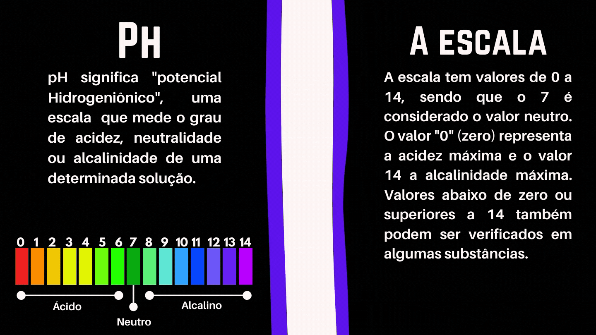
```

### Os tipos de experimentos científicos

Não existe apenas uma forma de realizar um experimento científico e essas podem mudar de acordo com o objetivo dele. 

O experimento realizado de forma prática envolve um processo de investigação com criação de hipóteses, baseadas na observação de um fenômeno controlado, culminando no levantamento de dados para a formulação de conclusões viáveis. Este tipo de experimento é bastante adequado à solução de problemas da natureza, ou para a melhoria de criações humanas - problemas com os quais podemos interagir e controlar -  como o desenvolvimento de um motor mais eficiente para um carro; a descoberta da origem de um comportamento em um grupo de pessoas; um estudo dos melhores tipos de solo para o plantio; ou para o desenvolvimento de um remédio para uma doença. 

Quando o experimento prático envolve a busca de compreensão acerca de problemas e dinâmicas da sociedade humana, eles são chamados de experimentos sociais. Esse tipo de experimento, geralmente envolve a participação de seres humanos, e normalmente precisa levar em consideração questões de ordem ética, como por exemplo: confidencialidade quanto se faz uso de informações pessoais, respeito aos desejos dos participantes, entre outras. 

Durante o ano de 2020 alguns dos estudantes participantes do Projeto Ciência de Dados na Educação Pública realizaram uma série de experimentos. Alguns dos títulos foram “Qualidade do atendimento em postos de saúde de Salvador”, “Diário de um confinado”, “Densidade de Sólidos e de Fluídos de um Campo de Petróleo”. A seguir apresentamos os objetivos desses experimentos e em quais tipo experimento eles se enquadram.

```{r figura32, echo=FALSE, out.width = '80%', fig.align='center'}
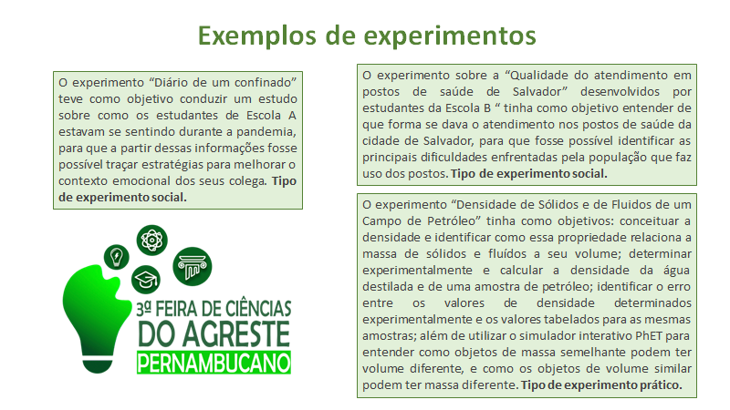
```

Existe também o experimento mental, que constitui um raciocínio lógico sobre um experimento não possível na prática, mas que as consequências podem ser exploradas pela imaginação. A prática de experimentos mentais não é uma invenção da ciência moderna. Entretanto, "Presume-se que os antigos filósofos gregos já usavam os experimentos mentais. Na verdade, eles muitas vezes os empregavam de maneiras semelhantes às dos filósofos contemporâneos, ou seja, tanto para defender suas próprias teorias como para refutar as teorias contrárias” (Lerodiakonou, 2018 p. 31; Becker, 2018; Fuhrer, 2009; Diamante, 2002 p. 229-232). O experimento mental se tornou famoso após ser usado por Albert Einstein, quando o cientista passou a investigar o Princípio da Relatividade.

-------------------
Você já ouviu falar sobre a **Teoria da Relatividade de Einstein**? 
Trouxemos esse vídeo que fala um pouco mais sobre ela: 

<div align = "center">
<iframe width="560" height="315" src="https://www.youtube.com/embed/fwzzgJOLZkM" frameborder="0" allow="accelerometer; autoplay; clipboard-write; encrypted-media; gyroscope; picture-in-picture" allowfullscreen></iframe>
</div>
</br>

------------

As respostas para perguntas científicas também podem ser adquiridas por meio de um estudo teórico investigativo não experimental, de forma a reinterpretar conceitos e teorias das diversas áreas a partir de um novo ponto de vista. Pode ser utilizada por exemplo para enfatizar, criticar e repensar teorias que foram feitas em um determinado contexto histórico e que podem ser replicadas e atualizadas para a realidade contemporânea. Nesse tipo de investigação é necessário correlacionar os textos lidos com outros conhecimentos, levando, portanto, à construção de hipóteses, sistematização de informações discutidas para construir relações com outros temas em pauta. 

 
<p>Por exemplo, no campo da pesquisa social, na década de 40 a filósofa feminista francesa Simone de Beauvoir afirmou: “Ninguém nasce mulher: torna-se mulher”. Essa ideia foi recuperada por pesquisadoras feministas, tais como as norte-americanas Joan Scott e Gayle Rubin, e a inglesa Ann Oakley que evidenciaram que há uma diferença entre sexo e gênero, sendo gênero socialmente construído..</p>

```{r figura34, echo=FALSE, out.width = '80%', fig.align='center'}

```

## Planejamento e organização de um experimento 

Acredito que você já tenha realizado algum experimento um dia, mesmo sem saber que estava realizando um. Quem nunca ouviu falar ou já fez o experimento de plantar o feijão em um potinho com algodão e água, muito comum nos livros de ciências para explicar o processo de **germinação/ou as etapas do crescimento da planta**. 

**Você sabe o que é germinação**? A germinação de uma semente pode ser definida como uma sequência ordenada de eventos que resulta no reinício do processo de desenvolvimento do embrião de uma planta (Marcos-Filho, 1986).

Esse é um exemplo de experimento bem simples, é um tipo de experimento realizado de forma prática, no qual o processo investigativo pode ser uma ferramenta de descobertas. Esse experimento também pode responder uma série de perguntas, e como vimos no Capítulo 2, sobre investigação científica, estabelecer uma ou mais perguntas que queremos responder sobre o assunto que vai ser trabalhado é o primeiro passo de uma investigação. Para o experimento com o grão de feijão algumas das perguntas listadas a seguir podem ser respondidas:


★	Como as plantas se alimentam?<br />
★	Quais são as partes da planta que tem origem da semente de feijão?<br />
★	Porque a germinação do feijão não ocorre no saco da embalagem?<br />
★	Como ocorre o processo de germinação?<br />
★	Qual a relação da luz do sol com o crescimento do feijão?
<br />

Além das perguntas levantadas que já podem servir de guia para organizar uma observação ou experimento, é importante pensar nas hipóteses que queremos testar. Como mencionado no Capítulo \@ref(cap2), as hipóteses tem o objetivo de apontar uma possível solução para o estudo em questão. Solução que deve ser baseada em conhecimentos prévios e em outros estudos já feitos, para que o experimento possa comprovar ou contestar. Ambos os casos são muito importantes, pois são considerados fontes de conhecimento para o problema estudado.

Como vimos no Capítulo \@ref(cap2), a partir da hipótese é possível direcionar com precisão os procedimentos investigativos que vamos utilizar para confirmar ou negá-las. Podemos entender a hipótese como uma espécie de fio condutor para a organização do experimento. Para o exemplo do feijão podemos levantar inúmeras hipóteses, como alguns exemplos listados a seguir:


★	As plantas se alimentam apenas de água.<br />
★	As plantas podem nascer apenas quando tem acesso a água, solo e luz.<br />
★	As plantas podem nascer tendo apenas acesso a solo e água e precisam da luz para crescerem.<br />
★	A planta do feijão tem caule, raízes e folhas.<br />
★	A planta do feijão tem caule, raízes, folhas e flores.
<br />

Todo experimento científico seja ele prático ou mental precisa de planejamento e organização. Para iniciar um experimento, é preciso, com base nas perguntas que queremos responder e hipóteses que queremos testar, definir e detalhar todas as etapas a serem executadas, assim como listar todos os materiais a serem utilizados. Essa organização permitirá que o experimento seja repetido várias vezes da mesma maneira (em diferentes lugares) ou de diferentes maneiras quando se deseja testar diferentes condições de experimentos (como variação de temperatura, tempo, luminosidade etc). Além disso uma investigação bem planejada reduz as chances de resultados errados, e também diminui o desperdício de tempo, e recursos da equipe. 
Quando vamos fazer um bolo por exemplo usamos uma receita para poder lembrar como fizemos ele da primeira vez e conseguir reproduzir da mesma forma. 

Abaixo trouxemos uma receita de bolo de chocolate. 

```{r figura35, echo=FALSE, out.width = '80%', fig.align='center'}
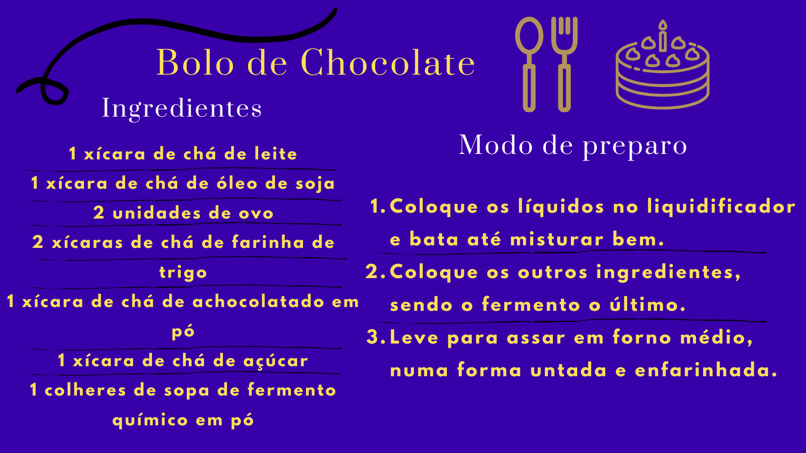
```

Além disso, todo experimento envolve um conjunto de variáveis, ou seja, algo que pode variar, mudar, ser observado, registrado, e que pode interferir no resultado final do experimento. Por exemplo, na receita do bolo, podemos aumentar a temperatura, diminuir o tempo ou alterar a quantidade de farinha. Colocando mais ou menos farinha, o que pode mudar o resultado final do bolo.

Para o experimento do feijão alguns dos materiais que podem ser usados são:

    ★	06 recipientes (copo ou prato pequeno).
    ★	Grãos de feijão.
    ★	Algodão.
    ★	Água.
    ★	Folha de papel.
    ★	Caixa de sapato com um furo.
    
Já os passos do experimento podem ser os seguintes:

    1.	Colocar um pouco de algodão no fundo dos seis recipientes.
    2.	Colocar um grão de feijão em cada recipiente e identificar   os recipientes de 1 à 6. 
    3.	Regar os recipientes 1, 2 e 3 com um pouco de água (variável 1) apenas o suficiente para umedecer o algodão e não regar os recipientes 4, 5, 6.
    4.	Cobrir os recipientes 3 e 6 com uma folha de papel (variável 2) e colocar em um local escuro.
    5.	Mover os recipientes 2 e 5 para a caixa de sapato fechada (variável 3), com um furo.
    6.	Colocar os recipientes 1, 2, 4, 5 em um local iluminado (variável 4).
    7.	Regar diariamente os recipientes 1, 2 e 3 observar e registrar as mudanças em todos os recipientes.


Abaixo trouxemos um cartaz ilustrativo com as principais informações para realizar o experimento do feijão:

```{r figura36, echo=FALSE, out.width = '60%', fig.align='center'}
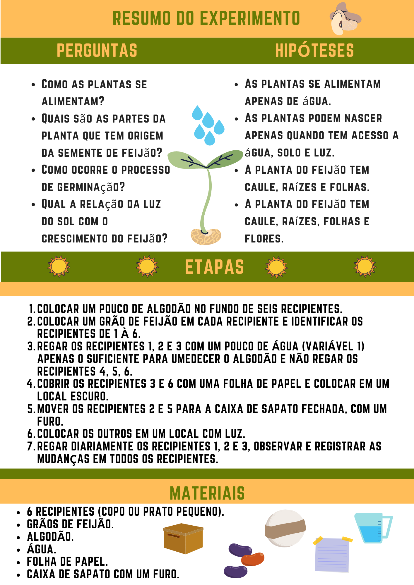
```

## Etapas da Investigação 

### Coleta ou produção de dados 

Durante os experimentos e observações, torna-se necessário coletar os dados produzidos. A coleta de dados pode ser feita de diversas formas: anotações, filmagens, fotografias. Independentemente da forma mais adequada, a coleta de dados deve ser feita visando coletar o máximo de detalhes possíveis. Todas as observações levantadas são importantes para análise da Hipótese e para obtenção de uma conclusão confiável. Abaixo trouxemos alguns exemplos de formas utilizadas para a coleta de dados e também de materiais que são usados com frequência para essa coleta.


```{r figura3789, echo=FALSE, out.width = '60%', fig.align='center'}
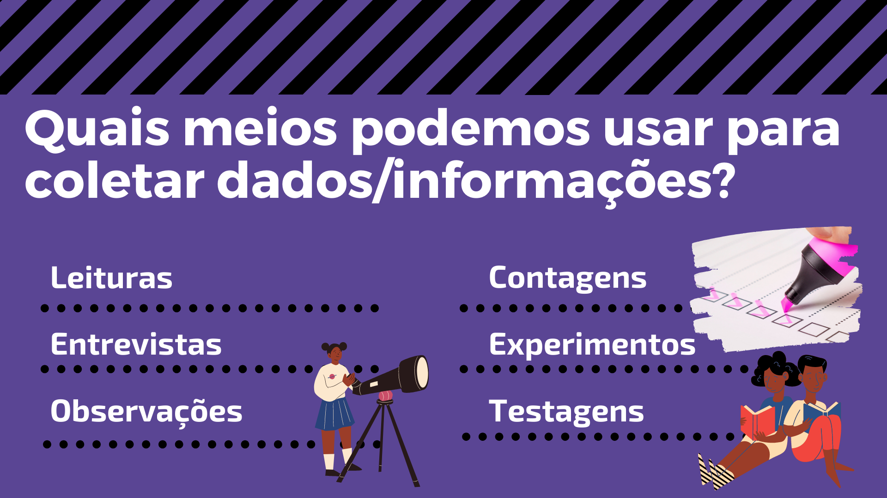

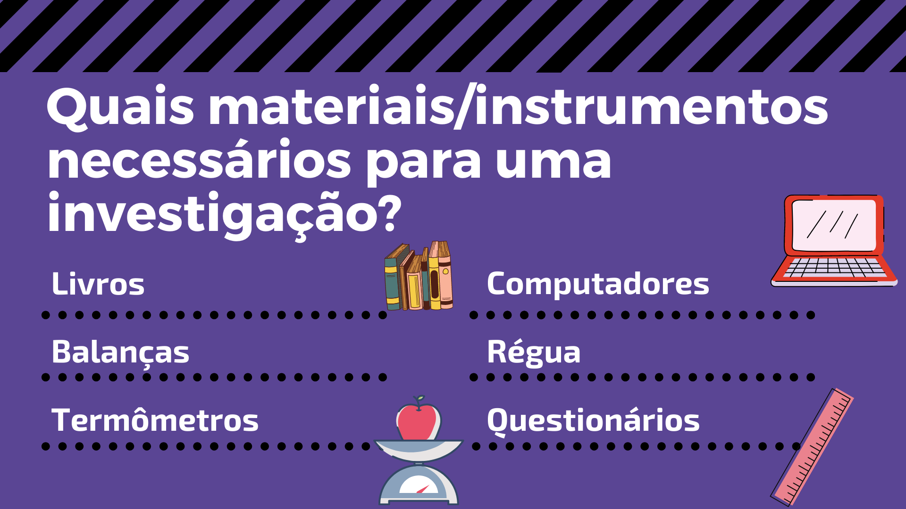
```

No experimento do feijão, alguns dados podem ser medidos, como: presença de raiz, folhas e caule, altura do caule, comprimento das folhas, coloração das folhas caule e raiz, tempo decorrido entre cada observação. Para registrar e organizar essas informações podem ser usada diferentes formas, entre elas listas, tabelas, fluxogramas, resumos etc. Que é fundamental para o bom desenvolvimento da etapa seguinte, que é analisar os dados.

### Análise dos dados

Após a coleta de dados, os pesquisadores/cientistas organizam os dados em resumos, tabelas e gráficos de diferentes tipos visando a criação de informações. Dados são observações armazenadas desde imagens salvas em seu celular até vídeos presentes no Youtube. Porém, sua existência não implica em significado ou sentido, e, portanto, não são suficientes para embasar decisões e conclusões. Por outro lado, ao organizar um conjunto de dados com o objetivo de criar um significado, conseguimos gerar informações. Em resumo os dados são considerados informações desorganizadas. 

Existem formas diferentes de classificar os dados usados em uma investigação, mas a mais comum é classificar os dados coletados como quantitativos e qualitativos. Dados quantitativos visam coletar fatos concretos: números. E quando organizados eles formam a base para tirar conclusões gerais da sua pesquisa. Dados qualitativos coletam informações que não buscam apenas uma medição, mas descrevê-lo, usando impressões, opiniões e pontos de vista. Embora essa abordagem proporciona uma compreensão mais detalhada das perguntas da pesquisa, ela dificulta a análise dos resultados.

<br />

> A análise dos dados é uma etapa muito importante da investigação científica e é explorada com outros detalhes no [E-book de  Ciências de Dados](https://bookdown.org/cienciadedadosnaep/ciencia_de_dados/).


**Mas, e as formas de organizar os dados coletados?** A seguir são apresentadas algumas maneiras de organização e representação dos dados ou das informações.

<br />
<p><em>➔	TABELA</em></p>
<br />

A tabela é uma forma muito comum de organizar os dados. Os dados na tabela normalmente são dispostos em colunas e linhas, para facilitar a comparação e análise, bem como, compreensão do leitor. Uma tabela, contém alguns elementos fundamentais, são eles:

★	Borda: a borda de uma tabela ou moldura é a demarcação das linhas e colunas onde serão inseridas as informações. De acordo com as normas da Associação Brasileira de Normas Técnicas (ABNT), ela não deve ter traços verticais que a delimitam à esquerda e à direita, e linhas horizontais só se admitem no cabeçalho e no rodapé.

★	Título: o título da tabela deve ser breve, claro e explicativo. Deve ser colocado acima da tabela, no canto superior esquerdo, logo abaixo da palavra Tabela (com a inicial em maiúscula) e acompanhado do número que a designa (tabelas devem ser numeradas com números arábicos de forma sequencial dentro do texto como um todo).  Por exemplo: Tabela 1, Tabela 2, Tabela 3 etc.

★	Informações: além do título e da moldura, é importante que a tabela contenha os dados ou as informações coletadas de forma clara, com uma fonte padronizada para números e texto, normalmente em trabalhos padronizados a fonte utilizada é Times New Roman ou Arial, tamanho 10.

Veja como exemplo a tabela abaixo, com dados gerados a partir da observação de um dos grãos de feijão:

<center>Tabela 1 - Observações do recipiente 1</center>

Dias de observação | Altura (cm) | Presença de folhas
:-----:|:------:|:-----:
1| 0 | Não
2| 0 | Não 
3| 0 | Não
4| 2 | Não
5| 3 | Não
6| 4 | Sim
7| 5 | Sim
8| 5 | Sim
9| 7 | Sim
10| 7 | Sim

<br />

```{r figura10, echo=FALSE, out.width = '70%', fig.align='center'}
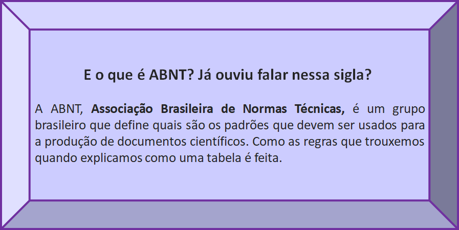
```

<br />
<p><em>➔	 QUADRO	</em></p>
<br />

Normalmente os quadros são formados por linhas verticais e horizontais e devem ser fechados em suas extremidades. Além de serem mais utilizados para expressar dados qualitativos, diferentemente das tabelas, e normalmente seguem algumas regras estabelecidas pela ABNT:

★	Inserir o mais próximo possível do texto a que se referem.<br />
★	No topo da ilustração inserir o tipo, número sequencial e título.<br />
★	Na parte inferior citar a fonte (mesmo que seja o próprio autor do trabalho).<br />
★	Centralizar o quadro, título, legenda e fonte.<br />
★	Utilizar fonte Times New Roman ou Arial, tamanho 10.<br />

Numeração do Recipiente | Observações
:-----:|:------:
1| O feijão cresceu bastante a partir do quarto dia
2|  O feijão cresceu bastante a partir do quarto dia, contudo o caule ficou extremamente curvo, e ele aparentemente cresceu na direção da entrada de luz da caixa de sapato.
3| O feijão formou raízes e começou a crescer, porém não criou pétalas e não cresceu muito.
4| O feijão não germinou
5| O feijão não germinou
6| O feijão não germinou

<center> <h6>Fonte: Elaborado pelos autores</h6> </center>
<br />

**VOCÊ SABE A DIFERENÇA DE UM QUADRO PARA UMA TABELA?**

A figura a seguir sintetiza as finalidades, formas e principais características existentes entre uma tabela e um quadro.

```{r figura311, echo=FALSE, out.width = '70%', fig.align='center'}
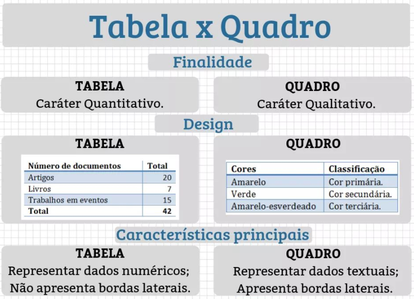
```
<center> <h6> Fonte: https://assunto.top/tabela-vs-quadro/ </h6> </center>

<br />
<p><em>➔	 GRÁFICO</em></p>
<br />

Um gráfico pode ser definido como uma tentativa de expressar informações, dados ou valores numéricos, de uma forma mais visual, assim facilitando a compreensão dos mesmos.

Existem vários tipos de gráficos e os mais utilizados são os de barras, colunas ou histogramas, de linhas e os setores ou pizza. Assim, como as tabelas independente do tipo de gráfico existem alguns elementos fundamentais que precisam estar presentes nos gráficos, listados a seguir:

★	Títulos: do gráfico, do eixo das abscissas (horizontal) e do eixo das ordenadas (vertical).
★	Legenda: um texto que fica ao lado dos eixos do gráfico, indicando o significado dos elementos utilizados, significado das cores e símbolos presentes.  
★	Fonte: local de onde foram retiradas as informações que estão presentes no gráfico.

   - Histograma 
   
O histograma ou gráfico de colunas é composto por dois eixos, um vertical e outro horizontal. Sempre utilizamos o primeiro quadrante do Plano Cartesiano. No eixo horizontal, são construídas as colunas que representam a variação dos dados na pesquisa realizada, da origem do plano para a direita, ou seja, no eixo vertical indicamos uma escala graduada de zero até o valor máximo que queremos representar e no eixo horizontal construímos colunas onde a altura de cada coluna informa o valor máximo pesquisado em cada item, as colunas devem sempre possuir a mesma largura e a distância entre elas deve ser constante. 

```{r figura312, echo=FALSE, out.width = '70%', fig.align='center'}
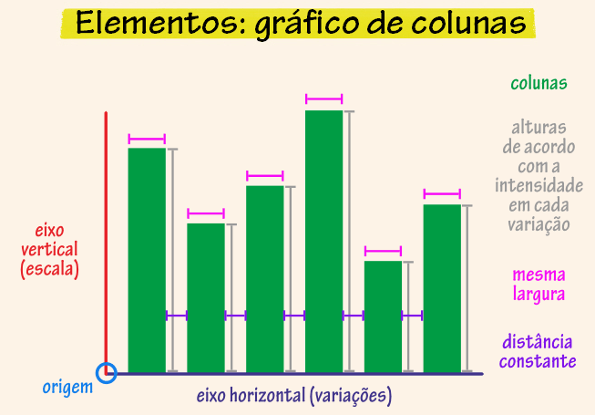
```
<center> <h6>Fonte: educa.ibge.gov.br</h6> </center>
<br />

```{r figura313, echo=FALSE, out.width = '70%', fig.align='center'}
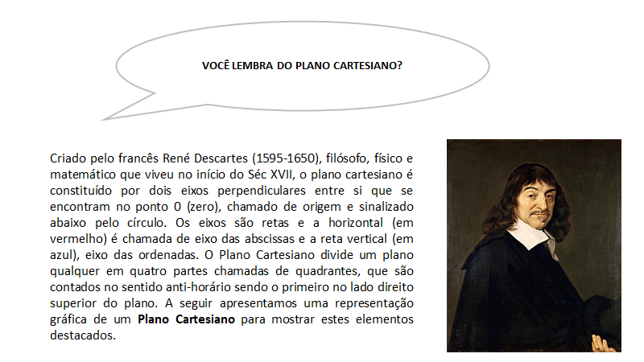
```
```{r figura314, echo=FALSE, out.width = '70%', fig.align='center'}
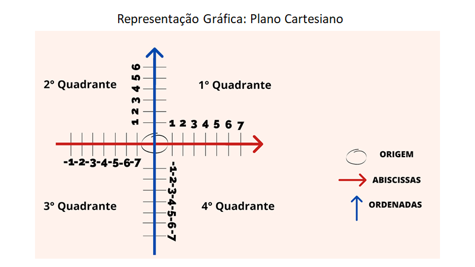
```


  - Gráfico de setores:
 
O gráfico de setores é um círculo dividido em setores no qual cada um representa uma proporção de um conjunto de dados. Muitas vezes é usado para mostrar percentual, onde a soma dos setores equivale a 100%. Este gráfico, geralmente usado para variáveis que podem ser divididas em categorias, onde cada setor é referente a uma determinada categoria e seu tamanho é proporcional a sua representatividade. 

No gráfico de setores apresentados a seguir, tente descobrir qual grupo é o maior e tente ordená-los de forma decrescente (do maior para o menor). Você provavelmente vai ter dificuldade para fazer isso. E por conta disso os gráficos de setores devem ser usados acompanhados de uma legenda informando a porcentagem ocupada por cada setor como indicado na imagem abaixo. 

```{r figura315, echo=FALSE, out.width = '70%', fig.align='center'}
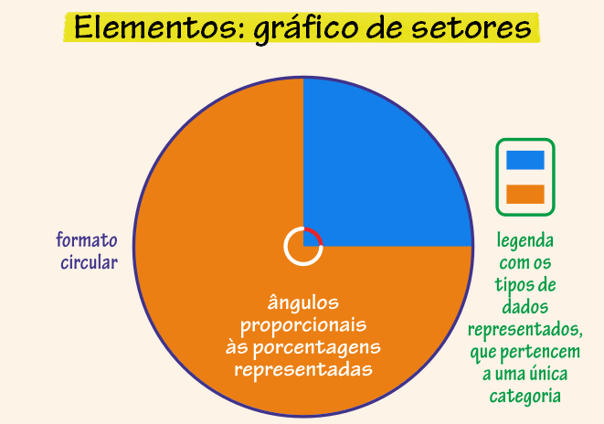
```
<center> <h6>Fonte: educa.ibge.gov.br</h6> </center>
<br />

  - Gáfico de linhas:
  
 Os gráficos de linhas são normalmente utilizados quando se deseja trabalhar com dois ou mais conjuntos de dados numéricos, eles são compostos por dois eixos, um vertical e outro horizontal. Pensando no Plano Cartesiano ele é representado no primeiro quadrante, e por uma ou mais linhas que mostram a variação dos dados na pesquisa realizada, isto é, a movimentação dos dados no decorrer do tempo.
 
É indicado quando uma das variáveis representa o tempo e se pretende revelar o movimento dos dados ao longo do tempo. Podemos por exemplo fazer um gráfico para a observação do experimento do feijão, visto que nossos dados variam com o decorrer dos dias.

```{r figura316, echo=FALSE, out.width = '70%', fig.align='center'}
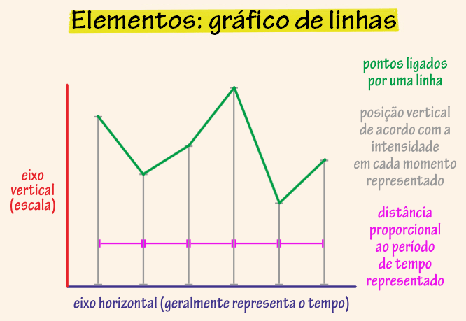
```
<center> <h6>Fonte: educa.ibge.gov.br</h6> </center>
<br />

**De que formas podemos utilizar os tipos diferentes de gráficos que aprendemos?**

Dois estudantes participantes do Projeto Ciência de Dados na Educação Pública, estudantes do Colégio Estadual Henriqueta Martins, fizeram uma pesquisa que tinha como objetivo conhecer a qualidade dos Postos de Saúde de Salvador a partir das pessoas que moram na cidade. Para coleta dos dados os pesquisadores utilizaram um questionário que foi aplicado de forma online.  A partir dos dados levantados foram elaborados alguns gráficos, apresentados a seguir.

```{r figura317, echo=FALSE, out.width = '70%', fig.align='center'}
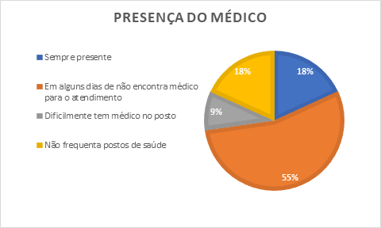
```
<center> <h6> Fonte: Jesus; Archanjo de Jesus; Melo; Cajado, 2020</h6> </center>
<br />
O Gráfico de Setores acima, mostra que a maioria dos respondentes não encontravam o médico que buscava em todas as visitas que realizava ao posto de saúde.


```{r figura318, echo=FALSE, out.width = '70%', fig.align='center'}
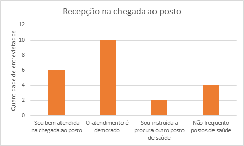
```
<center> <h6> Fonte: Jesus; Archanjo de Jesus; Melo; Cajado, 2020</h6> </center>
<br />
O Gráfico de Colunas acima, mostra que os respondentes que frequentam os postos de saúde acham o atendimento na recepção demorado. 

O Projeto elaborado pelas estudantes do Colégio Estadual Ypiranga “Diário de um confinado” tinha como objetivo levantar os efeitos do isolamento social em um grupo de estudantes da escola. Para coleta dos dados os pesquisadores utilizaram um questionário que foi aplicado de forma online. O Gráfico de Colunas apresentado a seguir mostra que 40% dos entrevistados acham que pós-pandemia tudo muda, 40% que algumas coisas mudam e para 20% nada muda.

```{r figura319, echo=FALSE, out.width = '70%', fig.align='center'}
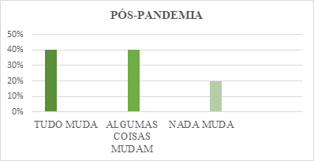
```
<center> <h6>Fonte:  Bastos; Silva; Santiago; Lima, 2020 </h6> </center>
<br />
No caso da investigação que sugerimos sobre o feijão, também podemos utilizar um gráfico para auxiliar na compreensão e organização dos dados.

```{r figura320, echo=FALSE, out.width = '70%', fig.align='center'}
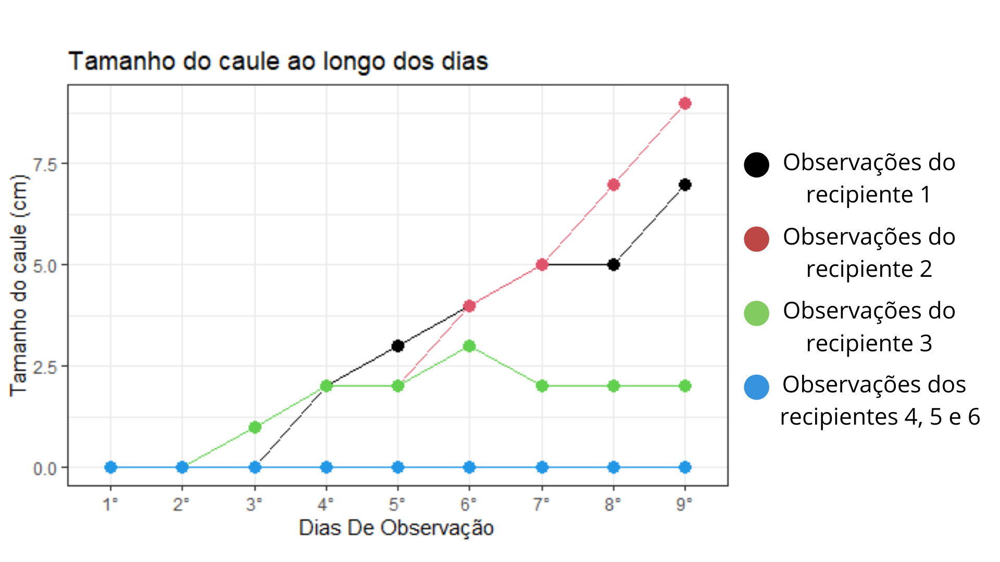
```

No Gráfico de Linha acima foi observado que os grãos de feijão do recipiente 1 e 2 apresentaram um crescimento maior do que o do recipiente 3, e os recipientes 4, 5 e 6 não mudaram de tamanho. Isto pode ter ocorrido pois os grãos de feijão dos recipientes 4, 5 e 6 não foram molhados, e o grão do recipiente 3, teve acesso à água, mas, não à luz. Enquanto que, os grãos dos recipientes 1 e 2 tiveram acesso a luz e água o que pode ter influenciado no seu maior desenvolvimento.


## Referências {-}
